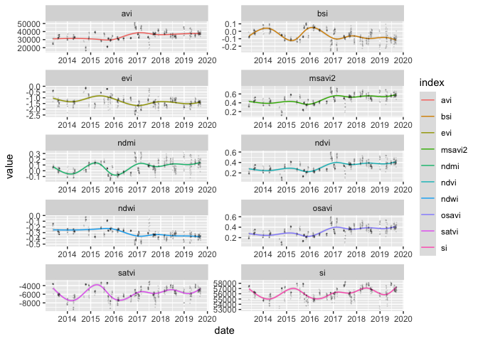

reSense
================
Pedro Blaya Luz
\| nov-2020

## Application

To see an example of the data obtained through this package in
production check out this **Shiny App**: [reNature - Farm
monitor](https://pedroblayaluz.shinyapps.io/farm-monitor/)

## Quick demo

### Set up

First we begin by installing the package.

``` r
devtools::install_github('pedroblayaluz/reSense')
```

Then we require both [reSense](https://github.com/pedroblayaluz/reSense)
and [rgee](https://github.com/r-spatial/rgee), on which reSense relies
to communicate with Google Earth Engine

``` r
require(reSense)
require(rgee)
```

Here we login to [Google Earth Engine](https://earthengine.google.com/)
using a gmail account.

``` r
ee_Initialize(email='insert.yours@gmail.com', drive=T)
```

### Gather the data

Now we use the function `shpToEE()` to convert a shapefile into a Google
Earth Engine Object and store it an object called `ee.geometry`. The
folder containing .shp file should also contain .dbf and .shx files.

``` r
ee.geometry <- shpToEE(shapefile="~/Dropbox/Science/reNature/reSense/data/shapefile.shp")
```

Now to the main functionality of reSense, we use `senseLandsat()` to
gather all available Landsat-8 multispectral images for `ee.geometry`
and also calculate the respective Vegetation Indices. Here we selected
all available VIs.

``` r
landsat.df <- senseLandsat(ee.geometry=ee.geometry,
                           start.date='2013-01-01',
                           end.date='2020-01-01',
                           VIs=c('avi', 'bsi', 'evi', 'msavi2', 'ndmi',
                                 'ndvi', 'ndwi', 'osavi', 'satvi', 'si'))
```

    ## [1] "|=================================================| 100%"

### Data visualization

Now let’s visualize the data. First some tidying up:

``` r
require(tidyverse)
landsat.tidy <- landsat.df %>%
  pivot_longer(cols=16:(dim(landsat.df)[2]-1),
               names_to='index',names_ptypes=factor,values_to='value') %>%
  select(-starts_with('B')) %>% select(-starts_with('scene'))
```

Plotting Vegetation Indices over time:

``` r
require(ggplot2)
landsat.tidy %>% ggplot(aes(x=date,y=value)) +
  geom_smooth(aes(color=index), size=.5, alpha=0.2, method='gam') +
  geom_jitter(alpha=0.1,size= 0.01)  +
  scale_x_date(date_breaks = '1 year', date_labels = "%Y") +
  facet_wrap(~index, scales = 'free', ncol=2)
```

<!-- -->

*\*There might be some errors in AVI, EVI, SATVI and SI due to problems
including constants in Google Earth Engine equations, needs some
reviewing.*

#### Animating NDVI over time on a map

Login to Google Cloud Maps Platform and get the map we need (see more in
[`ggmap`](https://github.com/dkahle/ggmap)).

``` r
require(ggmap)
#Login to Google Cloud Platform
register_google(key='insert tour API key')
#Get the map
sat.map <- get_map(c(mean(landsat.df$x), mean(landsat.df$y)),
                   maptype = 'satellite', zoom=19)
```

Process the data and create the animated plot using
[`gganimate`](https://github.com/thomasp85/gganimate) .

``` r
#Processing data for gif
landsat.df$year <- substring(landsat.df$date,1,4)
ndvi.year.mean <- landsat.df %>%
  group_by(x,y,year) %>%
  summarise(mean.ndvi = mean(ndvi))
ndvi.year.mean$year <- as.numeric(ndvi.year.mean$year)

#NDVI Gif
require(gganimate)
ndvi.gif <- ggmap(sat.map) +
  geom_tile(data = ndvi.year.mean , aes(x = x, y = y, fill=mean.ndvi), alpha=0.7,
            color='black') +
  scale_fill_continuous(low='beige', high='green') +
  transition_time(year) +
  labs(title='NDVI over time: {round(frame_time, 0)}')
animated.gif <- gganimate::animate(ndvi.gif,fps=30)
anim_save('animation.gif',animated.gif)
```


