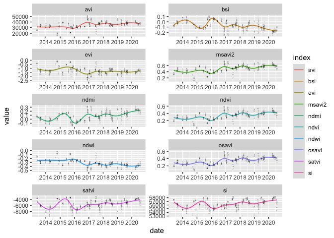

reSense
================
Pedro Blaya Luz

First we begin by installing the package.

``` r
devtools::install_github('pedroblayaluz/reSense')
```

    ## 
    ##      checking for file ‘/private/var/folders/71/1wg468hx51bd08fvhs4c1bw40000gn/T/RtmpoUOdSd/remotes84d7781866d/pedroblayaluz-reSense-0cd89a1/DESCRIPTION’ ...  ✓  checking for file ‘/private/var/folders/71/1wg468hx51bd08fvhs4c1bw40000gn/T/RtmpoUOdSd/remotes84d7781866d/pedroblayaluz-reSense-0cd89a1/DESCRIPTION’ (427ms)
    ##       ─  preparing ‘reSense’:
    ##    checking DESCRIPTION meta-information ...  ✓  checking DESCRIPTION meta-information
    ##   ─  checking for LF line-endings in source and make files and shell scripts
    ##   ─  checking for empty or unneeded directories
    ##   ─  building ‘reSense_0.1.0.tar.gz’
    ##      
    ## 

Then we require both reSense and rgee, on which reSense relies to
communicate with Google Earth Engine

``` r
require(reSense)
require(rgee)
```

Here we login to Google Earth Engine using a gmail account.

``` r
ee_Initialize(email='blaya.luz@gmail.com', drive=T)
```

    ## ── rgee 1.0.6 ─────────────────────────────────────────────────── earthengine-api 0.1.232 ── 
    ##  ✓ email: blaya.luz@gmail.com 
    ##  ✓ Google Drive credentials: ✓ Google Drive credentials:  FOUND
    ##  ✓ Initializing Google Earth Engine: ✓ Initializing Google Earth Engine:  DONE!
    ##  ✓ Earth Engine user: users/pedroblayaluz 
    ## ────────────────────────────────────────────────────────────────────────────────────────────

Now we use the function `shpToEE()` to convert a shapefile into a Google
Earth Engine object and store it an object called `ee.geometry`.

``` r
ee.geometry <- shpToEE(shapefile="~/Dropbox/Science/reNature/reSenseLocal/earth engine/data/hudson.shp")
```

    ## Reading layer `hudson' from data source `/Users/pedroblayaluz/Dropbox/Science/reNature/reSenseLocal/earth engine/data/hudson.shp' using driver `ESRI Shapefile'
    ## Simple feature collection with 1 feature and 1 field
    ## geometry type:  POLYGON
    ## dimension:      XY
    ## bbox:           xmin: -39.97109 ymin: -17.47084 xmax: -39.97007 ymax: -17.46966
    ## CRS:            NA

Now to the actual functionality of reSense, we use `senseLandsat()` to
gather all available Landsat-8 multispectral images for `ee.geometry`
and also calculate the respective Vegetation Indices.

``` r
landsat.df <- senseLandsat(ee.geometry=ee.geometry)
```

    ## [1] "|=================================================| 100%"

Now let’s visualize the data. First some tidying up:

``` r
require(tidyverse)
landsat.tidy <- landsat.df %>%
  pivot_longer(cols=16:25, names_to='index',names_ptypes=factor,values_to='value') %>%
  select(-starts_with('B')) %>% select(-starts_with('scene'))
```

Plotting Vegetation Indices over time:

``` r
landsat.tidy %>% ggplot(aes(x=date,y=value)) +
  geom_smooth(aes(color=index), size=.5, alpha=0.2, method='gam') +
  geom_jitter(alpha=0.1,size= 0.01)  +
  scale_x_date(date_breaks = '1 year', date_labels = "%Y") +
  facet_wrap(~index, scales = 'free', ncol=2)
```

<!-- -->

*\*There might be some errors in AVI, EVI, SATVI and SI due to problems
including constants in Google Earth Engine equations, needs some
reviewing.*
